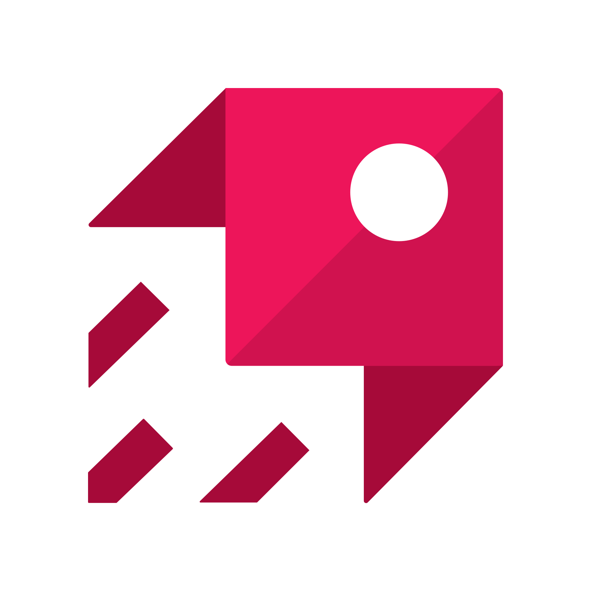

# 👋 Hi, I'm Mohammed Mafaz
 
💻 Java / Spring Boot Developer  
🎓 2025 Computer Science and Engineering Graduate   
📍 Bangalore, India   
🚀 Actively looking for **Java & Spring Boot Developer** opportunities  

---

## 🧠 About Me

- 💻 Passionate about **backend development**
- 🌱 Exploring scalable backend architectures & cloud deployment
- 🤖 Currently learning **Spring AI** and **Retrieval-Augmented Generation (RAG)**
- 📚 Enthusiastic learner with hands-on experience from **college and self-initiated projects**

---

## ⚡ Tech Stack

**Primary Skills**  

  
  
  
  
  
  
  
  
  
  
  

**Secondary Skills (used in college projects)**  

  
  

---

## 📂 Featured Projects

- 🚖 **SpringRide** – Uber-like Backend API *(Monolithic)*  
- 🍽️ **Zomato Backend API** – Food delivery backend *(Monolithic)*  
- 💼 **LinkedSphere** – LinkedIn-like Backend API  *(Micorservice Architecture)*
- 📓 **Journal App** – Frontend in React.js, Backend in Spring Boot

---

## 📜 Certifications & Training

-   **Spring Boot 0 to 1** — *Coding Shuttle*  
  *Skills learned:* Spring Core, Spring MVC, Spring Data JPA, Spring Security, JWT, OAuth, Spring Boot Actuator, Spring Dev Tools, Unit Testing (JUnit & Mockito), Integration Testing, AWS CI/CD pipeline

-   **Spring Boot 1 to 100** — *Coding Shuttle*  
  *Skills learned:* Spring Cloud, Netflix Eureka Discovery Client, API Gateway, Spring AOP, Transaction Management, Docker, Apache Kafka, Redis

- ☁️ **AWS Cloud Quest: Cloud Practitioner** — *AWS*  

- 💼 **Application Developer Training/Internship** — *Joint collaboration of Rooman Technologies and IBM*

---

## 📫 Connect with Me

---

**Fun fact**: I’ve maintained a 1200-day+ streak on Duolingo learning Arabic 🦉 !

⭐️ *Thanks for visiting my profile!*
